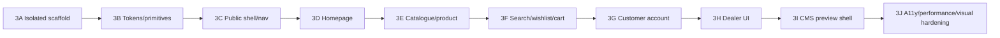

# Phase 3 Implementation Sequence

```mermaid
flowchart LR
  A["3A Isolated scaffold"] --> B["3B Tokens/primitives"]
  B --> C["3C Public shell/nav"]
  C --> D["3D Homepage"]
  D --> E["3E Catalogue/product"]
  E --> F["3F Search/wishlist/cart"]
  F --> G["3G Customer account"]
  G --> H["3H Dealer UI"]
  H --> I["3I CMS preview shell"]
  I --> J["3J A11y/performance/visual hardening"]
```

